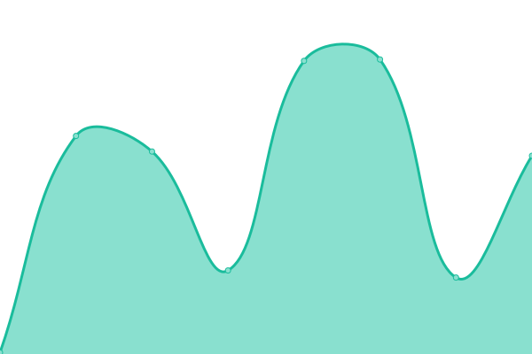
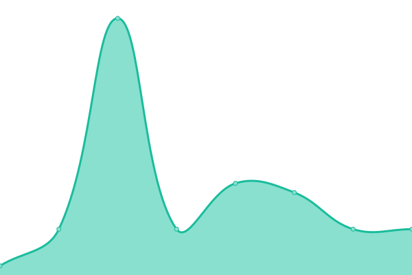

# [📈 Live Status](https://stats.beaglesecurity.com): <!--live status--> **🟩 All systems operational**

This repository contains the open-source uptime monitor and status page for [Beagle Security](https://beaglesecurity.com), powered by [Upptime](https://github.com/upptime/upptime).

With [Upptime](https://upptime.js.org), you can get your own unlimited and free uptime monitor and status page, powered entirely by a GitHub repository. We use [Issues](https://github.com/beaglesecurity/uptime/issues) as incident reports, [Actions](https://github.com/beaglesecurity/uptime/actions) as uptime monitors, and [Pages](https://stats.beaglesecurity.com) for the status page.

<!--start: status pages-->
<!-- This summary is generated by Upptime (https://github.com/upptime/upptime) -->
<!-- Do not edit this manually, your changes will be overwritten -->
<!-- prettier-ignore -->
| URL | Status | History | Response Time | Uptime |
| --- | ------ | ------- | ------------- | ------ |
|  [Website](https://beaglesecurity.com) | 🟩 Up | [website.yml](https://github.com/beaglesecurity/uptime/commits/HEAD/history/website.yml) | 

 107ms
     
 | 

<a href="https://status.beaglesecurity.com/history/website">100.00%</a>
    

|  [API](https://api.beaglesecurity.com/healthz) | 🟩 Up | [api.yml](https://github.com/beaglesecurity/uptime/commits/HEAD/history/api.yml) | 

 155ms
     
 | 

<a href="https://status.beaglesecurity.com/history/api">100.00%</a>
    

|  [Blog](https://beaglesecurity.com/blog) | 🟩 Up | [blog.yml](https://github.com/beaglesecurity/uptime/commits/HEAD/history/blog.yml) | 

 10ms
     
 | 

<a href="https://status.beaglesecurity.com/history/blog">100.00%</a>
    

|  [Engine1H](https://h.pug.gs/helthz) | 🟩 Up | [engine1-h.yml](https://github.com/beaglesecurity/uptime/commits/HEAD/history/engine1-h.yml) | 

 1005ms
     
 | 

<a href="https://status.beaglesecurity.com/history/engine1-h">100.00%</a>
    

|  [Engine2HOCR](https://hocr.pug.gs/helthz) | 🟩 Up | [engine2-hocr.yml](https://github.com/beaglesecurity/uptime/commits/HEAD/history/engine2-hocr.yml) | 

 855ms
     
 | 

<a href="https://status.beaglesecurity.com/history/engine2-hocr">100.00%</a>
    

|  [Engine3HTF](https://htf.pug.gs/helthz) | 🟩 Up | [engine3-htf.yml](https://github.com/beaglesecurity/uptime/commits/HEAD/history/engine3-htf.yml) | 

 848ms
     
 | 

<a href="https://status.beaglesecurity.com/history/engine3-htf">100.00%</a>
    

<!--end: status pages-->

[**Visit our status website →**](https://stats.beaglesecurity.com)

## 📄 License

- Powered by: [Upptime](https://github.com/upptime/upptime)
- Code: [MIT](./LICENSE) © [Beagle Security](https://beaglesecurity.com)
- Data in the `./history` directory: [Open Database License](https://opendatacommons.org/licenses/odbl/1-0/)
